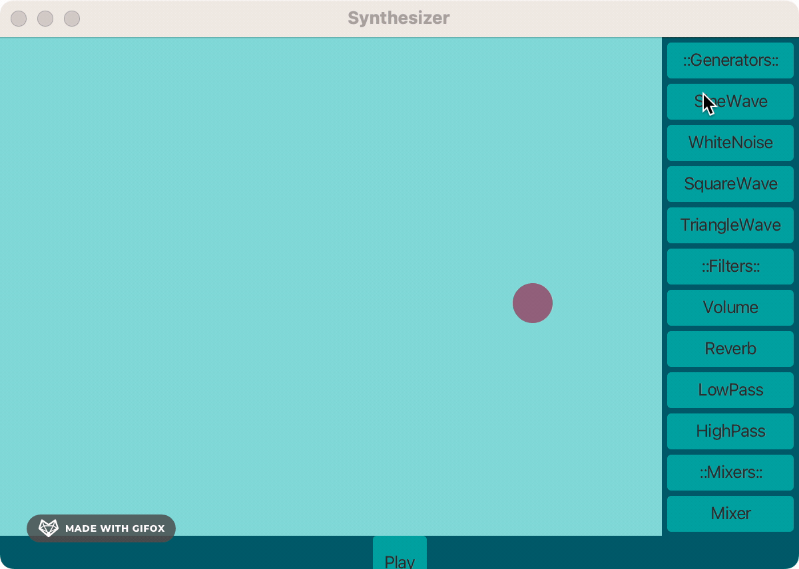

# Synthesizer
This program is designed to create, modify, and blend sine waves—acting as generators, filters, and mixers. With a GUI interface, you can experiment with these components by connecting them to one another and ultimately to a speaker. Have a blast crafting sounds! Hopefully, your musical talents will shine through better than mine did. 
## Steps Involved
This project started with the production of one sine wave, one filter, and one mixer. After these foundational components worked and the code was refactored, it was fun to add more components. 
## Future Steps
There are a changes on my to-do list to enhance the user experience:

- Ditch the current color scheme (I have changed it many times... but landed on purple and blue?)
- Right now, you can connect any item to any other item. I plan to refine the rules, making it so that you can only connect items with appropriate items.
- Add some 'keys,' like a keyboard, to play specific frequencies. This will make creating music and chords easier.
## Demo

## Try It Yourself!
1. Begin by cloning this repository, then open it using your preferred IDE. Compile the project from the "SynthesizeApplication" class.
2. Within the GUI interface, simply click any item on the right to trigger a box to pop out.
3. After obtaining a box (e.g., a sine wave), smoothly drag and drop it from one speaker (circle) to the corresponding circle on the right.
4. Once successfully connected, hit the "play" button at the bottom of the screen to unleash the symphony! 🎶 Make sure your volume is up, but not too loud. 
5. To manipulate the sinewave, you can pass it through a filter, or pass multiple sinewaves through a mixer. In order for the noise to play, it must be connected to the speaker (circle) at the far right. 
### Version History
View the full version history here: 

